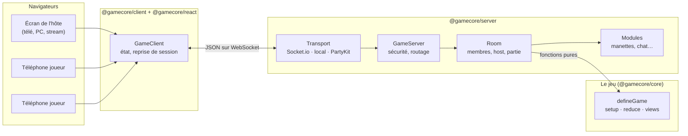
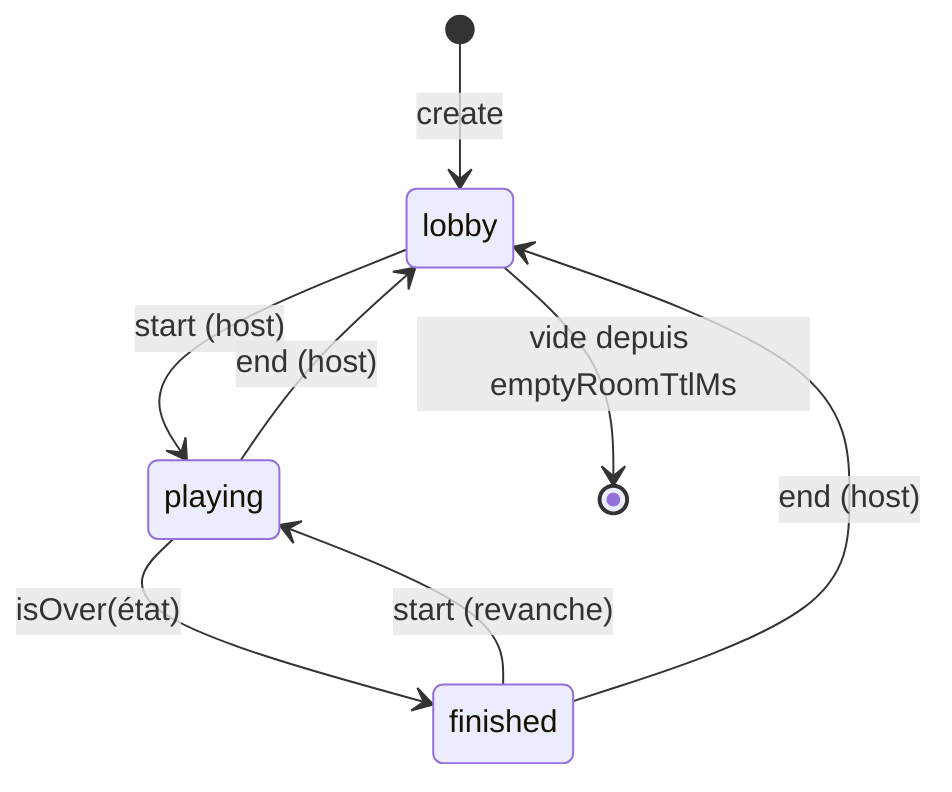
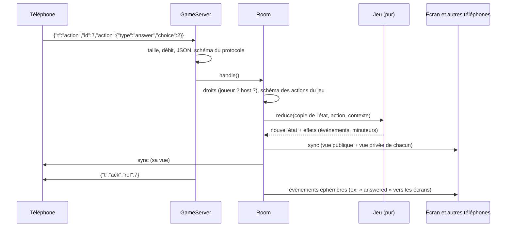

# Architecture

## Vue d'ensemble

- **Le jeu** est un ensemble de fonctions pures (`setup`, `reduce`, `views`) : aucune entrée/sortie, aucun hasard
  global, aucune horloge. Il ne connaît ni le réseau ni React.
- **Le serveur fait autorité.** Les clients envoient des intentions (« je réponds B ») ; le salon les valide avec le
  jeu, met l'état à jour, puis envoie à chaque connexion **sa** vue de la partie.
- **Le transport est interchangeable** : le même serveur tourne derrière Socket.io (Node), PartyKit (Cloudflare) ou
  directement dans la page (mode démo). Voir [ADR 0003](adr/0003-transports-interchangeables.md).

## Les paquets

| Paquet             | Rôle                                                                                                                    | Dépend de               |
| ------------------ | ----------------------------------------------------------------------------------------------------------------------- | ----------------------- |
| `@gamecore/core`   | `defineGame`, moteur pur (`applyAction`…), hasard déterministe, codes et jetons, protocole (zod), nettoyage des saisies | `zod`                   |
| `@gamecore/server` | `GameServer` (sécurité, routage), `Room` (salon), modules, adaptateur Socket.io, outils de test                         | `core`                  |
| `@gamecore/client` | `GameClient` (état, requêtes, reprise de session), transports Socket.io et local                                        | `core`                  |
| `@gamecore/react`  | `GameProvider`, hooks, `JoinQrCode`, `ControllerButton`, `Joystick`, `useWakeLock`                                      | `client`, `core`, `uqr` |

Tous sont isomorphes sauf mention contraire : `core`, `server` (hors `socket-io`) et `client` tournent dans un
navigateur, sous Node et sous Cloudflare Workers. Ils n'utilisent que des API standard (Web Crypto, `TextEncoder`,
`structuredClone`, `Intl.Segmenter`).

## Le salon

Un salon contient :

- des **membres** : joueurs ou spectateurs, avec pseudo, avatar, fournisseur d'identité (`guest`, `discord`…) ;
- un **host** : le créateur, puis le plus ancien joueur connecté s'il part ;
- des **écrans** : connexions sans siège qui affichent la vue publique ; l'écran qui a créé le salon reçoit un jeton
  d'administration qui lui donne les droits d'host (lancer, régler, expulser) ;
- la **partie** en cours : l'état complet du jeu (jamais envoyé tel quel), les joueurs figés au lancement, les
  minuteurs programmés et l'état du générateur aléatoire.

### Membres et connexions

| Situation                                               | Comportement                                                                        |
| ------------------------------------------------------- | ----------------------------------------------------------------------------------- |
| Rechargement de page, réseau coupé                      | Le membre reste, `connected: false`. Il reprend sa place avec son jeton (`resume`). |
| Absent depuis `lobbyGraceMs` (2 min) hors partie        | Sa place est libérée.                                                               |
| Absent pendant une partie                               | Sa place est gardée jusqu'à la fin de la partie.                                    |
| Même membre ouvert dans un second onglet                | L'ancienne connexion reçoit `bye: replaced`.                                        |
| Départ (`leave`) ou expulsion (`kick`)                  | Le membre est retiré ; s'il jouait, le jeu est prévenu (`onPlayerLeave`).           |
| Plus aucune connexion pendant `emptyRoomTtlMs` (10 min) | Le salon est fermé.                                                                 |

## Le flux d'un message

1. **Garde-fous** (`GameServer.receive`) : taille max, débit anti-inondation, analyse JSON, validation stricte par
   `clientMessageSchema`. Voir [sécurité](securite.md).
2. **Droits** (`Room`) : seul un joueur (ou l'host) peut agir ; les opérations de salon sont réservées à l'host.
3. **Règles** (le jeu) : `reduce` travaille sur une **copie** de l'état. Un refus (`ctx.reject`) ou une exception
   jette la copie : l'état n'est jamais à moitié modifié.
4. **Diffusion** : chaque connexion reçoit un `sync` avec sa vue. La vue publique est calculée une fois, la vue privée
   une fois par joueur.
5. **Effets** : les évènements (`ctx.emit`) partent après la synchronisation, vers leurs seuls destinataires ; les
   minuteurs (`ctx.schedule`) déclencheront plus tard une action système.

Toutes les modifications d'un salon sont **synchrones** (les seules attentes, le hachage des jetons, ont lieu avant).
Deux messages ne peuvent donc pas s'entrelacer : c'est ce qui garantit le « premier arrivé, premier servi ».

## Le hasard et le temps

- Chaque salon a son générateur pseudo-aléatoire **SFC32**, dont l'état (128 bits) est conservé avec le salon. Une
  même graine rejoue exactement la même partie : tests reproductibles, débogage d'une partie signalée.
- Le jeu reçoit `ctx.now` (horloge du serveur) ; les clients estiment le décalage de leur horloge (`ping`) pour
  afficher des comptes à rebours justes (`useCountdown`).
- Les minuteurs du jeu (`ctx.schedule(clé, délai, action)`) sont des **actions système** : elles passent par
  `reduce` comme les autres, avec `ctx.actor.kind === "system"`, et ne peuvent pas être envoyées par un client.

## Côté navigateur

`GameClient` expose un état immuable et un abonnement, branchés sur React par `useSyncExternalStore`. Il gère :

- la corrélation requête/réponse (`id` → `ack`/`error`) avec délai d'expiration ;
- la **reprise de session** : jeton mémorisé dans `sessionStorage` (par onglet), reprise automatique après une
  coupure, reprise explicite après un rechargement (`client.resume(code)`) ;
- l'ordre des états (une `version` plus ancienne est ignorée) ;
- les évènements du jeu, les entrées de manette (côté écran) et le chat.

Le jeu n'est importé côté navigateur qu'en `import type` : ses données secrètes (réponses, paquets de cartes…) ne
sont jamais envoyées aux joueurs.

## Choix techniques

- **Monorepo pnpm**, paquets ESM compilés par `tsc` (pas de bundler) ; en développement, les paquets sont lus depuis
  leurs sources (condition d'export `source`), sans build. Voir [ADR 0001](adr/0001-monorepo-et-paquets.md).
- **zod** pour toutes les validations (protocole, actions, réglages) : un seul schéma sert au typage et à la
  vérification à l'exécution.
- **Vues explicites** plutôt qu'un état « public + secret » séparé : voir
  [ADR 0002](adr/0002-serveur-autoritaire-et-vues.md).
