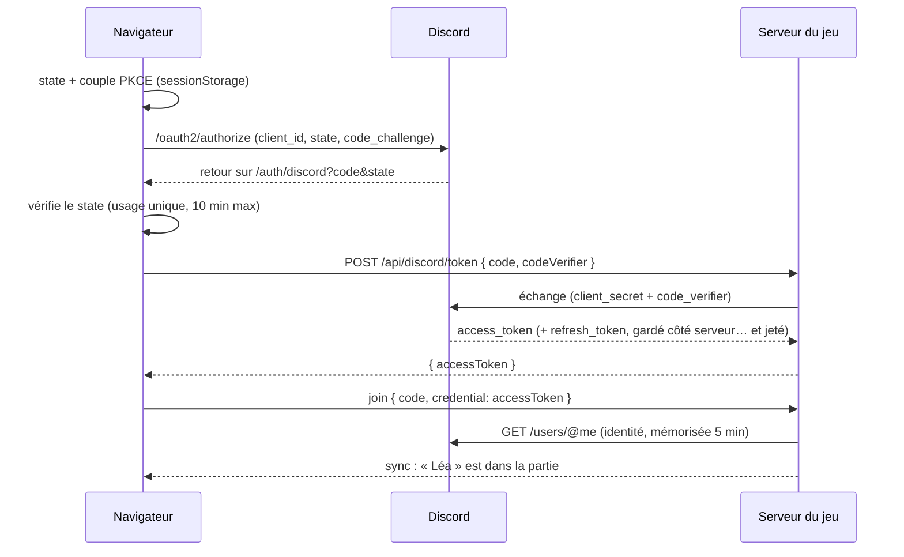

# Discord

Le paquet `@gamecore/discord` apporte deux intégrations, utilisables séparément :

| Intégration           | Pour quoi faire                                       | Expérience joueur                                               |
| --------------------- | ----------------------------------------------------- | --------------------------------------------------------------- |
| **Connexion Discord** | Jouer sur le site du jeu avec son identité Discord    | Bouton « Se connecter avec Discord » → pseudo et avatar Discord |
| **Discord Activity**  | Lancer le jeu **dans** Discord, depuis un salon vocal | Tout le salon vocal joue ensemble, sans code ni pseudo          |

Dans les deux cas, le joueur entre avec une **identité vérifiée** (identifiant Discord stable) : un compte expulsé
d'un salon ne peut pas y revenir, et un serveur peut exiger un compte (`requireAuth`).

## Comment ça marche



Dans une **Activity**, le SDK Discord remplace la redirection (`authorize` ouvre une fenêtre de consentement dans
Discord), toutes les requêtes passent par le proxy de Discord (`/.proxy/…`), et le code du salon gamecore est
**dérivé de l'identifiant de l'instance** : tous les participants arrivent dans le même salon, créé à la volée par le
premier (qui en devient l'host).

## Mise en place

### 1. Créer l'application Discord

1. Sur le [portail développeur](https://discord.com/developers/applications), crée une application.
2. **OAuth2** : note le _Client ID_, génère un _Client Secret_ (à garder secret : uniquement dans les variables
   d'environnement du serveur).
3. **OAuth2 → Redirects** (connexion web) : ajoute l'URL de retour, par exemple `https://buzzer.games.blzt.fr/auth/discord`
   (et `http://localhost:5173/auth/discord` pour le développement).
4. **Activities** (si le jeu doit se lancer dans Discord) :
   - active les Activities pour l'application ;
   - **URL Mappings** : associe le préfixe racine `/` au domaine du jeu, sans `https://` (ex. `buzzer.games.blzt.fr`) ;
   - choisis les plateformes (ordinateur, mobile) ; tant que l'application n'est pas publiée, lance-la depuis un
     serveur où tu as les droits (lanceur d'applications d'un salon vocal).

### 2. Configurer le serveur

| Variable                | Rôle                                                                        |
| ----------------------- | --------------------------------------------------------------------------- |
| `DISCORD_CLIENT_ID`     | Identifiant de l'application (public)                                       |
| `DISCORD_CLIENT_SECRET` | Secret de l'application : **jamais** dans le code du navigateur ni dans Git |
| `DISCORD_REDIRECT_URI`  | URL de retour de la connexion web, identique à celle du portail             |
| `DISCORD_ACTIVITY`      | `1` pour autoriser l'affichage du jeu dans Discord (CSP `frame-ancestors`)  |
| `ALLOWED_ORIGINS`       | Ajoute `https://<CLIENT_ID>.discordsays.com` (origine des Activities)       |

Côté code, avec `@gamecore/server` :

```ts
import { DISCORD_PROVIDER } from "@gamecore/discord";
import { createDiscordTokenHandler, discordAuthenticator, toNodeHandler } from "@gamecore/discord/server";

const game = new GameServer({
  game: monJeu,
  authenticate: discordAuthenticator(), // vérifie les jetons auprès de Discord
  // Activity : le premier compte Discord qui arrive crée le salon de l'instance.
  createOnJoin: (_code, identity) => identity.provider === DISCORD_PROVIDER,
});

const tokenRoute = toNodeHandler(
  createDiscordTokenHandler({ clientId, clientSecret, redirectUri }), // POST /api/discord/token
  { trustProxy },
);
```

L'exemple complet est dans [`examples/buzzer/server/index.ts`](../examples/buzzer/server/index.ts) : la configuration
publique (`/api/config`, sans secret) indique au navigateur si Discord est disponible.

### 3. Côté navigateur

Connexion web :

```ts
import { completeDiscordLogin, startDiscordLogin } from "@gamecore/discord/client";

// Bouton « Se connecter avec Discord » (le code du salon est conservé dans returnTo).
await startDiscordLogin({
  clientId,
  redirectUri: `${location.origin}/auth/discord`,
  returnTo: `/play/${code}`,
});

// Page /auth/discord
const { accessToken, returnTo } = await completeDiscordLogin({ tokenEndpoint: "/api/discord/token" });
await client.join(code, { name: "Discord" }, { credential: accessToken }); // le pseudo vient de Discord
```

Activity :

```ts
import { isDiscordActivity, startDiscordActivity } from "@gamecore/discord/client";

if (isDiscordActivity()) {
  // Le transport doit lui aussi passer par le proxy : socketIoTransport(undefined, { path: "/.proxy/socket.io" })
  const session = await startDiscordActivity({ clientId }); // tokenEndpoint : "/.proxy/api/discord/token"
  await client.join(
    session.roomCode,
    { name: discordDisplayName(session.user) },
    {
      credential: session.accessToken,
      create: true,
    },
  );
}
```

Dans le Buzzer, une Activity affiche l'interface « téléphone » à chaque participant (question, réponses, résultats) :
voir [`DiscordActivity.tsx`](../examples/buzzer/src/screens/DiscordActivity.tsx).

## Sécurité

- **Secret** : seul le serveur le connaît ; la route d'échange ne renvoie que le jeton d'accès (jamais le jeton de
  rafraîchissement) avec `Cache-Control: no-store`.
- **PKCE (S256)** sur les deux parcours : un code intercepté est inutilisable sans le vérificateur resté dans le
  navigateur.
- **`state`** aléatoire, à usage unique et valable 10 minutes : protège contre la falsification de requête (CSRF) ;
  le code est effacé de l'URL dès le retour.
- **Pas de redirection ouverte** : la destination après connexion ne peut être qu'un chemin du site.
- **Route d'échange** : corps JSON borné (4 Kio) et validé strictement, URL de retour fixée par le serveur, limite de
  20 échanges par minute et par IP.
- **Vérification d'identité** : chaque jeton présenté est vérifié auprès de Discord (`/users/@me`), le résultat est
  mémorisé 5 minutes sous l'**empreinte** du jeton ; un jeton mal formé n'est même pas transmis à Discord.
- **Bannissement** : l'expulsion d'un compte Discord vaut pour toute nouvelle tentative dans ce salon.
- **Salons d'Activity** : codes de 60 bits dérivés de l'identifiant d'instance (connu des seuls participants), créés
  uniquement par des comptes Discord vérifiés et seulement sur demande explicite (`create: true`).
- **Iframe** : par défaut le jeu refuse d'être intégré (`frame-ancestors 'none'`) ; `DISCORD_ACTIVITY=1` n'autorise
  que Discord.

Durcissement possible : vérifier, avec un jeton de bot, que le joueur fait bien partie de l'instance
(`GET /applications/{id}/activity-instances/{instance_id}`) avant de l'accepter dans le salon.

## Tests

- Unitaires ([`packages/discord/src`](../packages/discord/src)) : vecteur PKCE de la RFC 7636, `state` falsifié ou
  expiré, redirection ouverte, échange du code, cache de l'authentificateur, Activity avec un SDK simulé.
- Bout en bout ([`e2e/discord.spec.ts`](../e2e/discord.spec.ts)) : un faux Discord local
  ([`e2e/fake-discord.ts`](../e2e/fake-discord.ts)) applique les mêmes vérifications que le vrai (PKCE, code à usage
  unique, URL de retour) : connexion depuis un téléphone, compte expulsé qui ne peut pas revenir, réponse falsifiée,
  aucun secret côté navigateur.
- L'Activity elle-même ne peut être testée que dans Discord : lance-la depuis un salon vocal de test après chaque
  changement du parcours d'initialisation.
