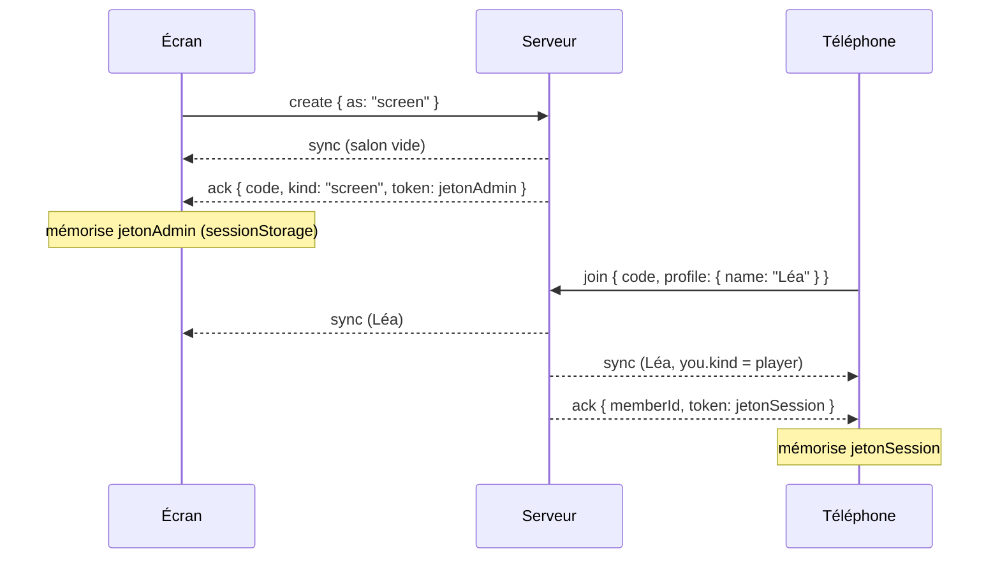
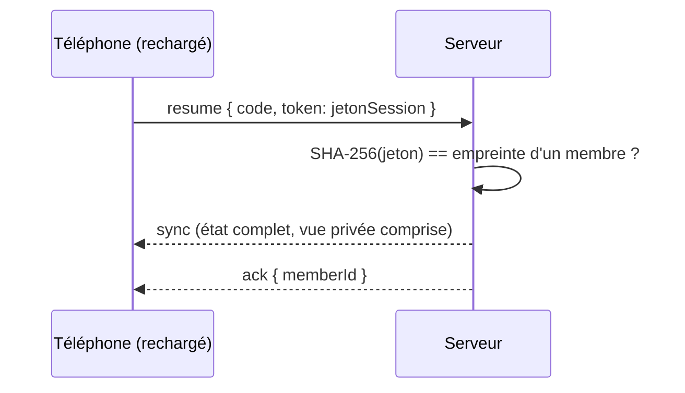

# Protocole

Les clients et le serveur échangent des messages **JSON en texte**, quel que soit le transport (Socket.io :
évènement `gc` ; PartyKit et local : message brut). Les schémas font foi : [`protocol.ts`](../packages/core/src/protocol.ts).

## Client → serveur

Chaque requête peut porter un `id` (entier ≥ 0) : la réponse (`ack` ou `error`) le renverra dans `ref`. Les messages
d'entrée dans un salon portent la version du protocole `v` (actuellement `1`).

| `t`      | Champs                                                                 | Réponse (`ack.data`)         |
| -------- | ---------------------------------------------------------------------- | ---------------------------- |
| `create` | `v`, `as: "screen" \| "player"`, `profile?`, `settings?`               | `Welcome` (avec le jeton)    |
| `join`   | `v`, `code`, `profile: { name, avatar? }`, `spectator?`, `credential?` | `Welcome` (avec le jeton)    |
| `resume` | `v`, `code`, `token`                                                   | `Welcome` (sans jeton)       |
| `watch`  | `v`, `code`, `adminToken?`                                             | `Welcome`                    |
| `leave`  | —                                                                      | —                            |
| `lobby`  | `op` : `start`, `settings`, `kick`, `promote`, `role`, `lock`, `end`   | —                            |
| `action` | `action` (validée ensuite par le schéma du jeu)                        | —                            |
| `input`  | `data` (sans `id` : pas de réponse)                                    | —                            |
| `chat`   | `body`, `channel?`                                                     | `{ id }`                     |
| `ping`   | —                                                                      | `{ now }` (heure du serveur) |

```ts
interface Welcome {
  code: string;
  kind: "player" | "spectator" | "screen";
  memberId: string | null; // null pour un écran
  token?: string; // jeton de session (membre) ou d'administration (écran) à conserver
}
```

Les objets sont **stricts** : un champ inconnu suffit à rejeter le message.

## Serveur → client

| `t`     | Contenu                                                                                                   |
| ------- | --------------------------------------------------------------------------------------------------------- |
| `ack`   | `ref`, `data?` : réponse positive                                                                         |
| `error` | `ref?`, `code`, `message` : erreur (en réponse à une requête, ou spontanée)                               |
| `sync`  | `version`, `room` (`RoomInfo`), `you` (`{ kind, id, isHost }`), `game` (`{ public, private? }` ou `null`) |
| `event` | `name`, `data?` : évènement éphémère du jeu                                                               |
| `input` | `from`, `data` : entrée de manette relayée (écrans)                                                       |
| `chat`  | `message` : `{ id, from, name, channel, body, at }`                                                       |
| `bye`   | `reason` : `kicked`, `left`, `closed`, `replaced` — fin de session dans ce salon                          |

`sync` est envoyé à chaque changement, avec l'état **complet du point de vue du destinataire** (pas de différentiel) :
un client qui rate un message n'est jamais désynchronisé. `version` augmente à chaque diffusion.

## Séquences

### Création par un écran, arrivée d'un joueur



### Reprise après un rechargement



Le serveur ne stocke que l'**empreinte** SHA-256 des jetons. Après une coupure réseau (sans rechargement), le client
renvoie lui-même `resume` (ou `watch` avec le jeton d'admin) dès la reconnexion.

## Codes d'erreur

| Code                      | Signification                                                      |
| ------------------------- | ------------------------------------------------------------------ |
| `BAD_REQUEST`             | Message mal formé, champ invalide, action hors schéma              |
| `UNAUTHORIZED`            | Jeton absent, expiré ou invalide ; identité refusée                |
| `FORBIDDEN`               | Action réservée (host, joueurs…), membre banni                     |
| `NOT_FOUND`               | Salon introuvable                                                  |
| `ROOM_FULL`               | Plus de place (membres, joueurs ou écrans)                         |
| `ROOM_LOCKED`             | Salon verrouillé par l'host                                        |
| `GAME_RUNNING`            | Impossible pendant une partie                                      |
| `NOT_PLAYING`             | Aucune partie en cours                                             |
| `RULE`                    | Refusé par les règles du jeu (`ctx.reject`)                        |
| `RATE_LIMITED`            | Trop de messages ou de tentatives                                  |
| `PAYLOAD_TOO_LARGE`       | Message trop volumineux                                            |
| `MODULE_DISABLED`         | Module non activé sur ce serveur                                   |
| `INTERNAL`                | Erreur inattendue (détail dans les journaux du serveur uniquement) |
| `TIMEOUT`, `DISCONNECTED` | Côté client : pas de réponse, connexion perdue                     |

## Limites par défaut

| Limite                     | Valeur                        | Option                                       |
| -------------------------- | ----------------------------- | -------------------------------------------- |
| Taille d'un message        | 16 Kio                        | `limits.maxMessageBytes`                     |
| Messages par connexion     | 20/s, rafale 40               | `limits.messagesPerSecond`, `messageBurst`   |
| Entrées de manette         | 60/s                          | `limits.inputsPerSecond` (+ débit du module) |
| Tentatives d'entrée ratées | 12/min par IP                 | `limits.failedJoinsPerMinute`                |
| Salons créés               | 10/min par IP                 | `roomsPerMinutePerIp`                        |
| Membres par salon          | 64                            | `limits.maxMembers`                          |
| Écrans par salon           | 4                             | `limits.maxScreens`                          |
| Infractions tolérées       | 10/min, puis fermeture (1008) | `maxViolationsPerMinute`                     |
